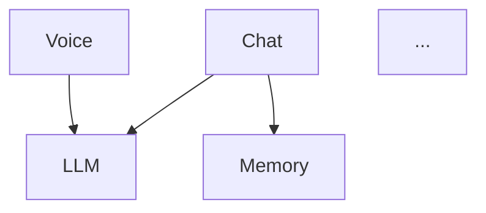

# Hanni Project Decomposition

Break down the entire Hanni project into logical modules, functions, and responsibility positions.

## Goal

Produce a clear map of 10-25 logical units that together cover 100% of Hanni's functionality. Each unit has:
- **Name** — short, clear identifier
- **Responsibility** — what it owns
- **Key functions** — main functions/commands in this unit
- **Files** — where the code lives
- **Dependencies** — what other units it depends on
- **State** — what data/state it manages

## Input

Optional `depth` argument:
- `overview` (default) — 10-15 high-level modules
- `detailed` — 15-25 modules with sub-functions listed
- `full` — every function mapped to a module

## Steps

1. **Scan the codebase:**
   - Count all `#[tauri::command]` functions in `lib.rs` (Rust backend commands)
   - Count all major JS functions in `main.js` (frontend logic)
   - List all DB tables (CREATE TABLE in lib.rs)
   - List all Tauri events (emit/listen)
   - Scan `voice_server.py` endpoints
   - Check `styles.css` for major sections
   - Check project file structure

2. **Group by domain:**
   Cluster every function/command into logical modules based on:
   - What data it operates on
   - What user-facing feature it serves
   - What system it talks to (LLM, DB, voice, filesystem, etc.)

3. **Define module boundaries:**
   For each module, define:
   - Clear responsibility (one sentence)
   - Inputs and outputs
   - What it owns (data, UI, behavior)
   - What it depends on

4. **Produce the map** in this format:

```markdown
# Hanni — Карта модулей

## Обзор
[Mermaid diagram showing all modules and their relationships]

## Модули

### M01: [Module Name]
- **Ответственность**: [one sentence]
- **Файлы**: lib.rs (строки X-Y), main.js (строки X-Y)
- **Rust команды**: command1, command2, ...
- **JS функции**: func1, func2, ...
- **DB таблицы**: table1, table2
- **События**: event1, event2
- **Зависимости**: M02, M05
- **Состояние**: [what state it manages]

### M02: [Module Name]
...
```

5. **Identify cross-cutting concerns:**
   - Error handling patterns
   - State management patterns
   - Authentication/authorization (if any)
   - Logging/monitoring

6. **Produce summary table:**

| # | Модуль | Rust cmds | JS funcs | DB tables | Сложность |
|---|--------|-----------|----------|-----------|-----------|
| M01 | Chat | 5 | 8 | 2 | High |
| M02 | Voice | 3 | 6 | 0 | High |
| ... | ... | ... | ... | ... | ... |

7. **Produce dependency diagram** (mermaid):


## Rules

- Respond in Russian
- Every function in the codebase must belong to exactly one module
- Modules should be cohesive (related things together) and loosely coupled
- 10-15 modules for `overview`, 15-25 for `detailed`
- Include line ranges where possible (approximate is OK)
- This is READ-ONLY — don't modify any code
- Use Task tool with Explore agents to scan large files efficiently
