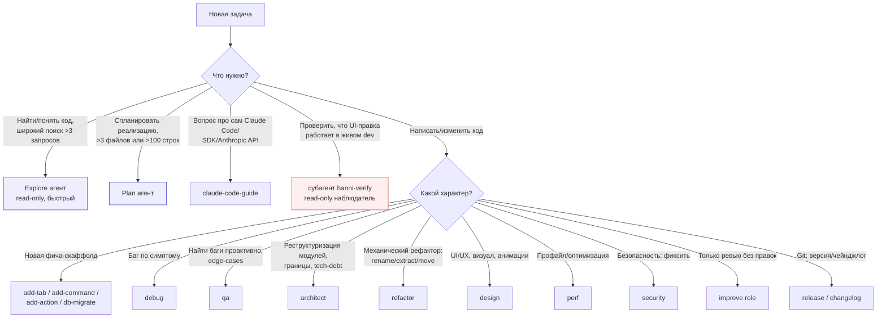

# Agent & Skill Routing — как Hanni выбирает исполнителя

Карта того, **как и где** Claude выбирает агента/скилл под задачу. Раньше выбор был чистой эвристикой «в голове» — этот документ делает его легальным и настраиваемым. Источник истины по роутингу; `CLAUDE.md` ссылается сюда.

## Три слоя исполнителей

| Слой | Что это | Как выбирается | Контекст |
|------|---------|----------------|----------|
| **Built-in агенты** | `Explore`, `Plan`, `general-purpose`, `claude-code-guide` | Claude делегирует через Agent-tool по задаче | Изолированный, своё окно |
| **Кастомные субагенты** | `hanni-verify` (см. `.claude/agents/`) | Авто-делегирование по полю `description` **или** явный вызов | Изолированный, узкий tool-set |
| **Скиллы** | `architect`, `debug`, `design`, `release`… (`.claude/skills/`) | Явный вызов `/<skill>` или подбор на шаге Clarify | В основном диалоге |

Ключевое: **субагент не видит контекст основного диалога** — годится для fan-out поиска, изолированной проверки, параллельной работы. **Скилл работает в текущем контексте** — годится, когда нужна история диалога.

## Decision tree

## Routing-таблица

| Задача | Исполнитель | Почему он |
|--------|-------------|-----------|
| Широкий поиск по репе (>3 запроса, «где X?») | **Explore** агент | Read-only, дешёвый, fan-out; вернёт вывод, не дамп файлов |
| План реализации (>3 файлов / >100 строк) | **Plan** агент | Проектирует подход, взвешивает альтернативы |
| «Как работает фича X в Claude Code/SDK/API?» | **claude-code-guide** | Знает хуки, скиллы, MCP, Agent SDK |
| Сложная многошаговая работа с правками | **general-purpose** | Explore + правки в одном изолированном агенте |
| Подтвердить, что UI-правка работает в dev | **hanni-verify** | Read-only драйв приложения (screenshot + eval), зашитые safety-ограничения |
| Скаффолд таба/команды/экшена/миграции | скиллы `add-*`, `db-migrate` | Пошаговый рецепт + регистрация |
| Расследование конкретного бага | скилл `debug` | Симптом → причина → фикс |
| Превентивный отлов багов, edge-cases | скилл `qa` | Статанализ, стресс-сценарии |

## Скиллы: справочник и разведение границ

| Скилл | Когда | НЕ путать с |
|-------|-------|-------------|
| `architect` | Модуляризация, границы, дробление god-файлов, tech-debt — **правит код** | ↔ `refactor` |
| `refactor` | Механика: rename / extract / move / dedupe с трекингом зависимостей | ↔ `architect` (тот про *структуру/логику*, этот про *механику*) |
| `debug` | Дан симптом → systematic трасса к корню | ↔ `qa` |
| `qa` | Проактивно ищет баги/edge-cases, пишет тест-сценарии | ↔ `debug` (тот *реактивный* по симптому, этот *проактивный*) |
| `improve <role>` | **Read-only ревью** с экспертной линзы (security/architect/perf/designer/product/qa) | ↔ role-скиллы ниже |
| `security` | **Активно фиксит** уязвимости, аудит входов, SQL/shell/path | ↔ `improve security` (тот только *ревьюит*) |
| `perf` | **Активно** профилит и оптимизирует | ↔ `improve perf` (только *ревью*) |
| `design` | **Активно** улучшает UI/UX | ↔ `improve designer` (только *ревью*) |
| `deps` | Аудит/обновление Cargo/pip/npm | — |
| `docs` | Синк `docs/architecture/` с кодом | — |
| `release` / `changelog` | Bump версии, тег, чейнджлог из коммитов | — |

**Главное разведение:** `improve <role>` = **смотрит и советует** (read-only). Одноимённый role-скилл (`security`, `perf`, `design`, `architect`) = **делает правки**. Сначала `improve` для ревью → потом role-скилл для исполнения.

## Built-in агенты (документируем, не клонируем)

Эти агенты встроены — **не** создавать их копии в `.claude/agents/` (копия дрейфует от оригинала):
- **Explore** — read-only поиск, Haiku по умолчанию, для широких sweep'ов. Указывай breadth.
- **Plan** — сбор контекста и проектирование стратегии.
- **general-purpose** — исследование + многошаговое исполнение с правками.
- **claude-code-guide** — вопросы про Claude Code / Agent SDK / Anthropic API.

## Как расширять

- **Новый субагент** → файл `.claude/agents/<name>.md` с frontmatter `name` + `description` (узкий, с негативными клаузами против ложного авто-делегирования), опц. `tools`, `model`. Body = системный промпт. Виден в `/agents`.
- **Новый скилл** → папка `.claude/skills/<name>/SKILL.md`. Проектные — здесь; глобальные (`audit-projects`, `handoff`, `dissertation-review`) — в `~/.claude/skills/`.
- После добавления — отрази в этой карте (таблица + дерево).
